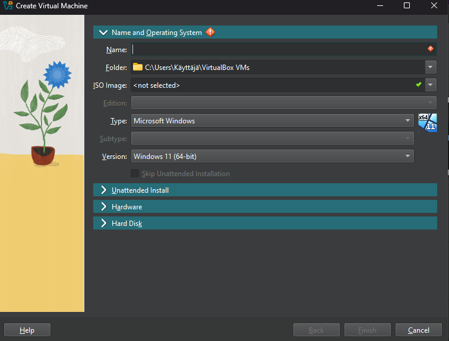

# h1 - Kotitehtävät

## Tiivistelmät

x.) Raporttiohje:

-kirjoita samalla kun teet

-kuvaa kaikki toiminta mahdollisimman tarkasti, jotta toistettavuus paranee

-lähetä vikailmoitukset eteenpäin, jotta ongelmat saadaan korjattua

-merkitse lähteet

-kuvaa toimintaasi totuudenmukaisesti

  Free Software Definition:
  
-vapaalla softalla tarkoitetaan ohjelmistoa, jota voidaan vapaasti ajaa, sen koodia voidaan tutkia ja muokata, jakaa, sekä jakaa muokattuna vapaasti eteenpäin. 

-vapaa softa voi olla maksullinen tai ilmainen, sekä kaupallinen 

-vapaan softan tärkeimmät kriteerit:

   *oltava kenen tahansa käytössä, mihin tahansa tarkoitukseen
   *lähdekoodi on julkinen, sekä vapaasti muokattavissa
   *vapautta jakaa lähdekoodia, joko alkuperäisenä tai muokattuna 
   

## a.) Virtuaalikoneen ja Debianin asennus

Aloitin virtuaalikoneen ja Debianin asennuksen kotona tiistaina 14.1 kurssin ensimmäisen luennon jälkeen klo 20.52, hakemalla Tero Karvisen 2024 laatimat yksityiskohtaiset asennusohjeet sivulta https://terokarvinen.com/2021/install-debian-on-virtualbox/ . 

 

Koneena minulla on Asus Vivobook Pro 15 -läppäri, host OS Windows 11 Home. 

Suoritin: 11th Gen Intel(R) Core(TM) i5-11300H @ 3.10GHz   3.11 GHz

RAM: 8GT

Ennen Debianin latausta, latasin Oracle Virtual Boxin osoitteesta https://www.virtualbox.org/wiki/Downloads. 

Asennuksen yhteydessä, järjestelmä herjasi että " Python core package and win32api are needed", ja että jos niitä ei asenna nyt, ne täytyy määrittää manuaalisesti jälkeenpäin. Jatkoin asennusta, ja ajattelin selvittää myöhemmin, mitä nämä olivat. 
Virtualboxin lataus sujui tämän jälkeen loppuun ilman ongelmia tai uusia viestejä.
 
Asennusohjeen mukaisesti, menin seuraavaksi hakemaan Debianin latauspakettia osoitteesta  https://cdimage.debian.org/debian-cd/current-live/amd64/iso-hybrid/.
Sivun auetessa, hämmennyin hetkikseksi, koska paketteja olikin useampia, hieman eri nimisiä. Minulla ei ollut mitään käsitystä siitä, mitä nämä eri versiot olivat, ja mikä niistä pitäisi valita. Luin ohjetta läpi uudelleen,
ja löysinkin ohjeesta tiedon, että nimi tulisi olla jotakuinkin tämä: debian-live-12.6.0-amd64-xfce.iso. 
Listan lopusta sitten löytyikin oikea versio, ja lähdin lataamaan pakettia. 

Latauksen jälkeen avasin virtual boxin, ja aloin luoda ensimmäistä virtuaalikonetta. Koneen luominen meni muutoin pitkälti ohjeen mukaan, mutta ongelmia kohtasin siinä kun piti valita virtual optical disc file.
Yritin saada sinne avattua koneelleni ladattuja tiedostoja, mutta mikään niistä ei näyttänyt sopivan kyseiseen tarkoitukseen. Hetken aikaa asiaa pähkittyäni, avasin youtuben, ja laitoin hakuun 'Install Debian on virtual box'.
Ensimmäinen video oli SavvyNik :in video "How to Install Debian 12 on VirtualBox in Windows | Beginners Guide". Se kuulosti juuri sopivalta minulle. Ensin luulin ongelman liittyvän siihen,
kun asennuksen aloituksessa en videon mukaisesti ollut klikannut aiemmin "ISO Image" -täppää aktiiviseksi. Tämän jälkeen poistin koko latauksen, ja latasin koko Debian -paketin uudelleen. 
Aloittaessani virtuaalikoneen luomista uudelleen, totesin ettei sellaista kohtaa edes ollut minun luomissivullani.

Katsoin videota hetken eteenpäin, ja lopulta tajusin videon mukaisesti raahata tiedoston suoraan ladattujen tiedostojen kansiosta ilman tiedoston avaamista,
jolloin se toimi ja pääsin eteenpäin. 
Virtuaalikoneelle päästyäni testasin ensin, että se toimii. 'Applications' -valikosta avasin nettiselaimen klikkaamalla 'Web Browser', ja kirjoitin osoiteriville terokarvinen.com. Sivu aukesi onnistuneesti, jonka jälkeen suljin selaimen.

Tämän jälkeen aloin asentaa Debiania. Avasin virtuaalikoneen, ja vasemman reunan "Install Debian" kuvaketta klikkaamalla etenin asennukseen. Klikkailin asennusohjeen mukaisesti oikean sijainnin, kielen (englanti), näppäimistön (Finnish) ja testasin ääkkösten toimivuuden testilaatikossa.
'Partitions' -välilehdellä valitsin 'Erase disk', ja 'Users' -välilehdellä syötin puolestaan omat tietoni, sekä asetin salasanan. 'Summary' -lehden tarkistuksen jälkeen klikkasin sivun alareunasta 'Install' -painiketta. 
Kone raksutteli asennusta hetken aikaa, kunnes tuli valmista.

Seuraavaksi ohjeessa oli kohta "Solve a Black Screen with xforcevesa (optional)". Luin ohjeen läpi, mutta minun mielestäni kyseessä oli niin vähäpätöinen ongelma, etten alkanut suorittaa tätä kohtaa ohjeesta. 
Sen sijaan, etenin ohjeessa kohtaan "First Steps". Siinä pyydettiin avaamaan virtuaalikoneelta terminaaliemulaattori, ja klikkailin 'Applications' -valikosta 'Terminal Emulatori'in auki.
Seuraavaksi ohjeena oli listata kaikki uusimmat versiot komennolla

      $ sudo apt-get update

Järjestelmä pyysi tämän jälkeen vielä salasanaa.
Seuraavaksi ladattiin kaikki nämä uusimmat versiot komennolla  

     $ sudo apt-get -y dist-upgrade

Tämän jälkeen asensin ja käynnistin palomuurin komennoilla 

    $ sudo apt-get -y install ufw 
    $ sudo ufw enable

Tämän jälkeen kirjauduin ulos virtuaalikoneesta, sekä käynnistin sen uudelleen (Application ja sieltä Log Out -> Restart).

## Lähteet

Tero Karvinen, Linux Palvelimet 2025 alkukevät: https://terokarvinen.com/linux-palvelimet/

Tero Karvinen, 2006, Raportin kirjoittaminen. https://terokarvinen.com/2006/raportin-kirjoittaminen-4/ 

Free Software Foundation, 2024, What is free software? https://www.gnu.org/philosophy/free-sw.html

Tero Karvinen, 2024, Install Debian on Virtualbox. https://terokarvinen.com/2021/install-debian-on-virtualbox/

Debian Live Image download. https://cdimage.debian.org/debian-cd/current-live/amd64/iso-hybrid/

Virtual Box Installer. https://www.virtualbox.org/wiki/Downloads

YouTube, SavvyNik, 2024. How To Install Debian 12 on VirtualBox in Windows. https://www.youtube.com/watch?v=GkIb-l1K2FQ

