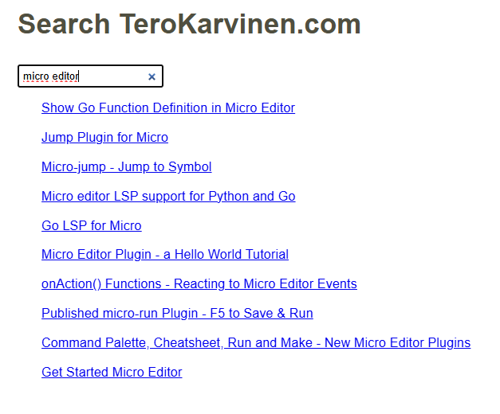
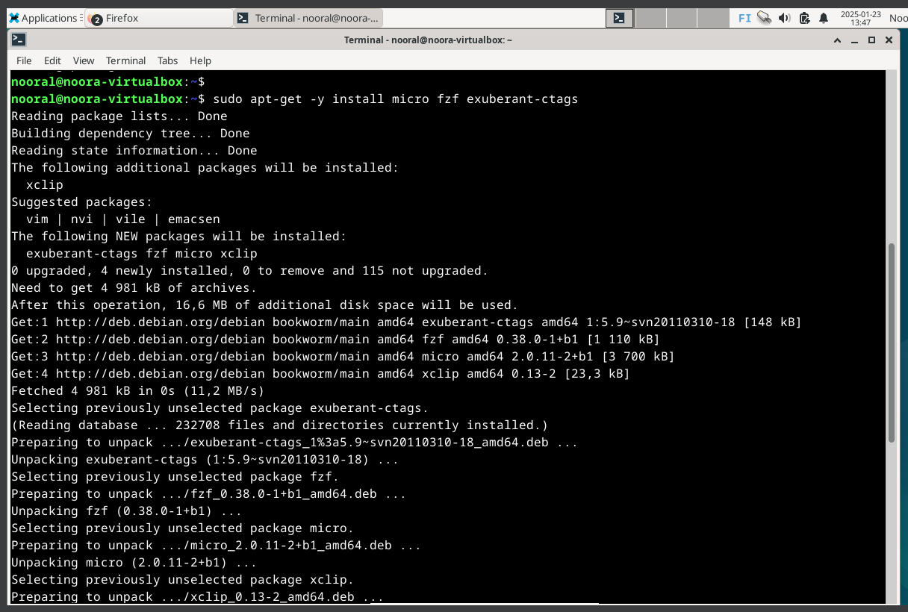
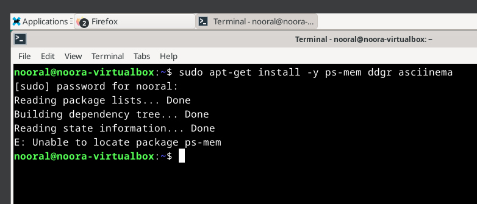
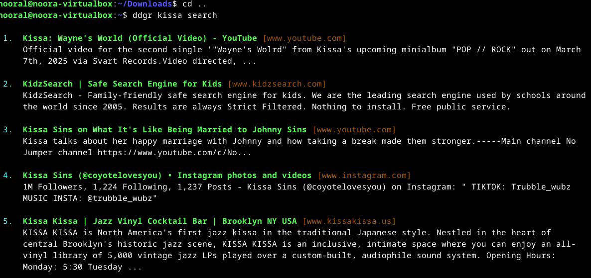
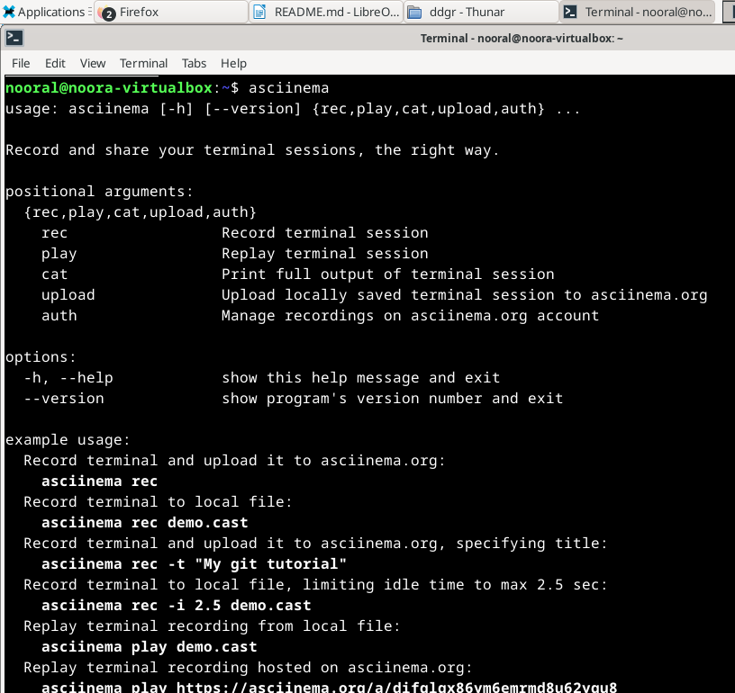
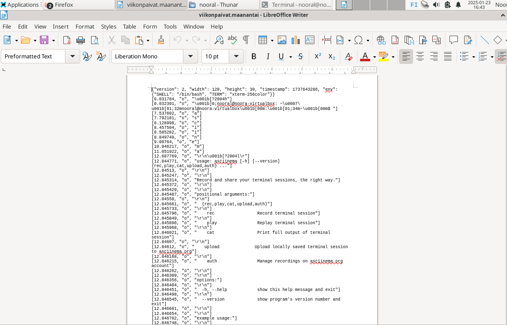
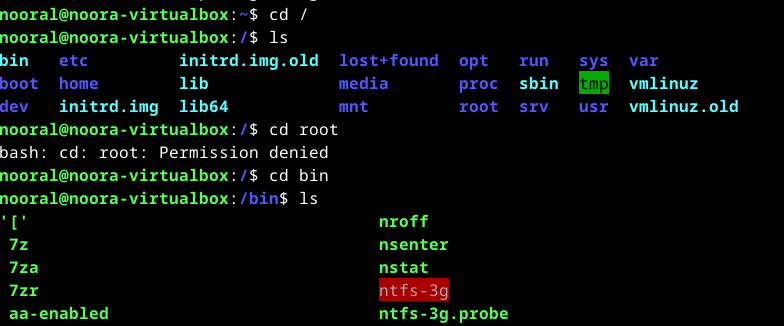
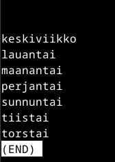
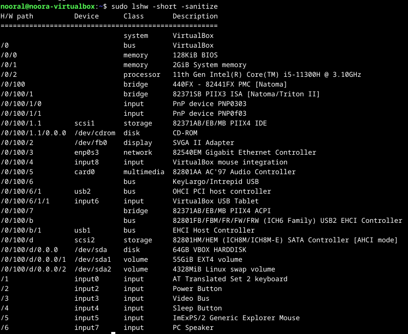
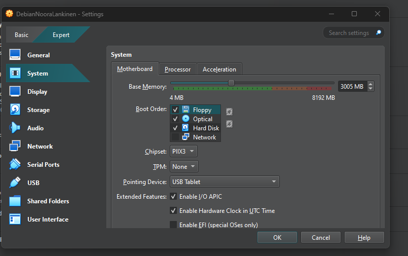

# h2 Komentaja Pingviini    

# x) Lue ja tiivistä

    $ sd = working directory, eli kansio jossa olet nyt

    $ ls = list files, näyttää kansiossa olevat tiedosto  
    $ cd = change directory, siirry valikossa. Esim. $ cd home/ 
    $ less = näytä tekstitiedoston sisältö. Esim. $ less kissa.txt

    sivulla liikkuminen= Use space ” ” for next page, “q” to quit. “b” Moves backwards, slash “/” searches.
      
    $ pico TAI nano esimerkki.txt = uuden tekstitiedoston luonti. Tiedoston tallennus ja exit: CTRL-X y Enter . 
    $ mkdir = uusi kansio. Esim. $mkdir kansio1
    $ mv = siirrä tai uudelleennimeä
    $ cp -r ORIGINAL COPY = kansion kopioiminen. Kansion sisällön kopioiminen: $ cp -r KANSIONNIMI/* KANSIOJOHONKOPIOIDAAN

    $ sudo = unlimited priviledges
    $ rm JUNK = poista tiedosto
    $ rm -r FOLDEROFJUNK = poista koko kansio ja sen tiedostot

    $ sudo apt-get update = näyttää saatavilla olevat päivitykset

Kysymys: Miten kopioidaan kansion sisältö useisiin kansioihin? Eli kuten eilisessä tehtävässä, jossa kaikkiin (ma-su) kansioihin piti saada samat tekstitiedostot? Entä saako kansioita luotua kerralla useampia?

# a) Micro

Fyysinen kone: 
Suoritin	11th Gen Intel(R) Core(TM) i5-11300H @ 3.10GHz   3.11 GHz
Asennettu RAM	8,00 Gt (7,70 Gt käytettävissä)
Käyttöjärjestelmä	Windows 11 Home, 23H2
Näytönohjain: Intel Iris Xe Graphics

Virtualbox, Debian 64-bit

Lähdin asentamaan micro -editoria keskiviikkona 22.1.2025 klo 10.40. Menin ensin verkkosivulle https://terokarvinen.com/, mutta etuvivulta ei heti löytynyt asennusohjetta, joten laitoin sivun oikean yläreunan hakupalkkiin hakusanoiksi "micro editor". 

Klikkasin auki viimeisen hakutuloksen, joka äkkiseltään vaikutti osuvimmalta. Ja sieltä löytyikin ohje kyseisen ohjelman asentamiseen (https://terokarvinen.com/get-started-micro-editor/?fromSearch=micro%20editor).

Avasin virtualboxin, ja sieltä Debianin. Syötin järjestelmän pyytämän salasanan päästäkseni kirjautumaan virtuaalikoneelle. 
Työpöydän alareunasta klikkasin auki terminal emulatorin. 
Hain ohjelmien viimeisimmät päivitykset komennolla $ sudo apt-get update.
Sen jälkeen itse ohjelman asennuksen komennolla $ sudo apt-get -y install micro fzf exuberant-ctags.

Asennuksen jälkeen halusin testata asennuksen toimivuutta. Avasin edellisellä tunnilla luodun kansion $ cd viikonpaivat/maanantai, sen jälkeen komento $ micro testausta.txt. 
Ja micro-editori aukesi ruudulle. Ctrl + Q -y -komennolla ulos editorista. Eli editori toimi kuten pitikin. 

# b) Apt

Aloitin tämän tehtävän torstaina 23.1 klo 13.06. Lähdin ensin etsimään tietoa eri ohjelmista, joita voisin tähän harjoitukseen käyttää. En tiennyt etukäteen yhtäkään Linux -ohjelmaa, joten menin Gooleen (https://google.com) ja kirjoitin hakuun "linux cli program". Hakutuloksista valitsin sivun (https://www.linuxlinks.com/100-great-must-have-cli-linux-applications/),
jolla listattiin hyödyllisiä Linuxin cli-ohjelmia. Valitsin kokeiltaviksi nohjelmat ps_mem (https://github.com/pixelb/ps_mem), ddgr (https://github.com/jarun/ddgr) ja asciinema (https://asciinema.org/). 
Tehtävän lopussa oli kysymys, osaanko asentaa kaikki kolme ohjelmaa samalla kertaa. En tietenkään etukäteen osannut, mutta siihenkin löytyi ohje YouTubesta hakusanoilla "linux apt-get install several programs", Roel Van Der Paarin video (Ubuntu: Apt-get install multiple packages without stopping (2 Solutions!!)).
Videolta sain komennon $ sudo apt-get install ohjelma1 ohjelma2 ohjelma3. 
Kirjauduin virtualboxiin ja avasin etusivun alareunasta terminal emulatorin. Siellä näkyi vielä edellisen päivän micron asennus, ja huomasin että tuossa YouTubesta saamassa komentokehotteessa ei ollut tuota '-y'sanojen install ja ohjelman nimen välissä, ja päätin sen sinne lisätä.
Annoin siis terminaalissa komennon $ sudo apt-get install -y ps-mem ddgr asciinema. 
Vastaukseksi sain virheilmoituksen, jonka mukaan ensimmäistä ensimmäistä asennuspakettia ps-mem ei löytynyt. 

Jatkoin videon katsomista, ja siinä neuvottiin myös kaksi tapaa toimia, mikäli asennus lakkaa sen vuoksi että jokin paketeista ei löydy. Ensimmäisen kohdalla tosin oli varoitus, että toiminto voi myös rikkoa koneen. Päätin jättää sen kokeilematta. 
Olin myös unohtanut hakea sovellusten uusimmat päivitykset, joten tein sen tässä välissä, kun kerran asennuskaan ei onnistunut. Eli komennolla $ sudo apt-get update.
Tämän jälkeen toiveikkaana testasin ohjelmien asennusta uudestaan, samalla komennolla kuin aiemmin. Jos vaikka aiemmpi herja olisi johtunut siitä, kun päivitystä ei oltu tehty.
Saman toiminnon suorittaminen johti kuitenkin (yllättäen) myös täysin samaan lopputulokseen. Selasin välissä Tero Karvisen ohjeistuksen komentorivikomennoista (https://terokarvinen.com/2020/command-line-basics-revisited/?fromSearch=command%20line%20basics%20revisited),
mutta en ainakaan suoraan löytänyt sieltä vastausta ongelmaani. En oikein tiennyt, mitä tällaisessa tapauksessa pitäisi tehdä. Ps-mem -GitHub -sivu oli kolmisen vuotta vanha, joten kaiketi on myös mahdollista ettei kyseistä ohjelmaa enää ole.
Jatkoin kuitenkin YouTuben videoiden selaamista, toivoen löytäväni sieltä lisää ratkaisuehdotuksia. Niitä ei kuitenkaan suoraa tullut, ja olin jo käyttänyt sen verran aikaa tähän asennukseen, että päätin luopua kunnianhimoisesta suunnitelmastani 
saada kaikki kolme kerralla ladattua, ja tyytyisin kahteen asennukseen kerralla. Komento $ sudo apt-get install -y ddgr asciinema. Ja tällä kertaa lataus onnistui ilman mitään herjoja. 
Seuraavaksi klikkasin työpöydän alareunan File Managerin auki tarkastellakseni ladattuja tiedostoja. En tiennyt, mistä lähteä hakemaan tiedostoja, joten File Managerin hakukenttään 'ddgr', josta sitten löysin kyseisen ohjelman tiedostoja. Yhdessä kansioista (/usr/share/doc/ddgr/)
löysin tiedoston readme.exe, jonka sisällä oli käyttöohjeet ko. ohjelmaan. Ohjeen perusteella menin takaisin terminaaliin, ja kirjoitin komennon $ ddgr kissa search. 
Tämän jälkeen näkyviin avautui hakutuloksia kyseisestä hakusanasta. Eli ohjelma toimi kuten pitikin.

Äskeisen kokeilun perusteella kirjoitin seuraavaksi terminaaliin pelkän $ asciinema. Sillä sain auki ohjeita ohjelman käyttöön.

Ohjeen perusteella kirjoitin komennon $ asciinema rec demo.cast -h, jolla sain tarkempia ohjeita tallennukseen. 
Aloitin tallennuksen $ asciinema rec viikonpaivat.maanantai :lla, ja tallensin tiedostoon osan ohjeistuksia. Sen jälkeen $ exit -komennolla pois
tallennustilasta. Löysin tallennetun tiedoston aiemmin kurssilla luodusta viikonpaivat -kansiosta. Eli tämänkin näyttäisi toimivan luvatusti.

Koska kolmannen softan kanssa oli ongelmia, päädyin lataamaan sen tilalle lolcat:in (https://www.tecmint.com/lolcat-color-output-linux-terminal/). Asennus sujui, jonka jälkeen testasin ohjelmaa hakemalla sovelluksien uusimmat päivitykset $ sudo apt-get update -komennolla.

# c) FHS

Root directoryyn siirryin komennolla $ cd / , ja siellä olevan sisällön sain näkyville komennolla $ ls. Siirryin kansioon bin, komennolla $ cd bin. Ja taas kansion sisältö näkyviin $ ls -komennolla.

/home

/home/nooral

/etc/

/media/

(kansio on tyhjä)

/var/log

# d) The Friendly M

Luin terminaalista ohjeen komennolla $ man grep. Ihan en kuitenkaan hahmottanut sen perusteella tämän ohjelman toimintaa, joten googletin vielä "grep linux". Ensimmäisessä hakutuloksessa (https://www.howtogeek.com/496056/how-to-use-the-grep-command-on-linux/) olikin jo kattavasti selitettynä esimerkkikomennoilla
kyseisen komennon käytöstä. 

Hain luomastani viikonpaivat -kansiosta alikansion keskiviikko, ja sieltä tekstidokumentista kilppari.txt sanaa "asd":

Toinen grep -testaus oli etsiä tiedostosta viikonpaivat.maanantai, montako 'i' -kirjainta tiedostossa esiintyi:

# e) Pipe

Pipe esiintyi jo aiemmin tehtävässä b. lolcatin testauksen yhteydessä, mutta otetaan tähän vielä toinen esimerkki. 

$ ls viikonpaivat -komennolla näytetään alikansiot maanantaista sunnuntaihin, samalla rivillä. Mutta komennolla $ ls viikonpaivat | less, näkymä onkin seuraavanlainen, kun jokainen alikansio on omalla rivillään:

# f) Rauta

Yritin lähteä suoraa liikenteeseen komennolla $ sudo lshw -short -sanitize, mutta tuli herja "sudo : lshw : command not found. Oletin tämän tarkoittavan, että lshw täytyy silloin asentaa. $ sudo apt-get install -y lshw. Sen jälkeen komento listasi alla olevat 
tiedot virtuaalikoneen hardwaresta: 

Listauksesta näkyy, että sekä järjestelmänä että bussina toimii Virtual Box. 
Välimuistia BIOS:illa on käytössä yhteensä 128 kilotavua.
Suoritin on sama kuin fyysisen koneen suoritin, 11th Gen Intel(R) Core(TM) i5-11300H @ 3.10GHz 3.11 GHz.
RAM-muistia on vain 2 gigabittiä. Se on melko vähän, mutta periaatteessa pitäisi riittää tämän kurssin vaatimuksiin. Samoin tallennustila 64GB. Molempia saa toki tarvittaessa lisättyä. 
Näytönohjaimena on VirtualBox SVGA II Adapter, PCI bridgenä puolestaan 440FX - 82441FX PM. 

Päätin kuitenkin varmuuden vuoksi hieman lisätä RAM-muistia, ja pyysin siihen ohjeet ChatGPT:ltä (https://chatgpt.com/c/67938214-1ba4-800d-952e-02c1099efecd).
Ohjeen mukaisesti sammutin virtuaalikoneen. Sen jälkeen avasin VirtualBoxin, ja klikkasin hiiren oikealla painikkeella vasemmassa reunassa olevan virtuaalikoneen päällä. Aukeavasta valikosta 'Settings' -> 'System'. 'Motherboard' -välilehti oli jo auki, ja säädin muistin 
kohtaan 3005MB, ja klikkasin alta 'ok'-kuvaketta.

Tämän jälkeen avasin virtuaalikoneen uudelleen, ja hain koneen tiedot uudelleen samalla $ sudo lshw -short -sanitize -komennolla. Ja nyt RAM olikin 3GB. 

## Lähteet

ChatGPT: https://chatgpt.com/c/67938214-1ba4-800d-952e-02c1099efecd

LinuxLinks, 100 Great Must Have Cli Linux Applications:  https://www.linuxlinks.com/100-great-must-have-cli-linux-applications/

Tero Karvinen 2024, Command Line Basics Revisited: https://terokarvinen.com/2020/command-line-basics-revisited/?fromSearch=command%20line%20basics%20revisited

Tero Karvinen, Get Started Micro Editor: https://terokarvinen.com/get-started-micro-editor/?fromSearch=micro%20editor

HowToGeek, How To Use Grep Command On Linux: https://www.howtogeek.com/496056/how-to-use-the-grep-command-on-linux/

Roel Van Der Paar 2021, Ubuntu: Apt-get install multiple packages without stopping (2 Solutions!!): https://www.youtube.com/watch?v=gaZYYApnW8I

Ddgr : https://github.com/jarun/ddgr

Asciinema: https://asciinema.org/

Lolcat: https://www.tecmint.com/lolcat-color-output-linux-terminal/

    
      
