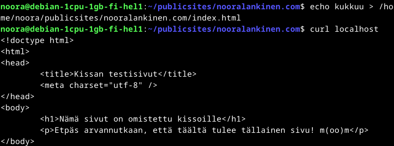

# x) Lue ja tiivistä

## Apache Name-based Virtual Host Support

# a) Apache2 -asennus

Fyysinen kone: Suoritin 11th Gen Intel(R) Core(TM) i5-11300H @ 3.10GHz 3.11 GHz
Asennettu RAM 8,00 Gt (7,70 Gt käytettävissä) 
Käyttöjärjestelmä Windows 11 Home, 23H2 Näytönohjain: Intel Iris Xe Graphics

Oracle Virtualbox Version 7.1.4 r165100 (Qt6.5.3)
Debian Live 12.9.0, amd64-xfce

Päivitys $sudo apt-get update:lla. 
Apache 2 asensin jo tunnilla 28.1 klo 17.40 alkaen, komennoilla  

    $ sudo apt-get -y install apache2
    $ echo "Default"|sudo tee /var/www/html/index.html

Testasin, että default page toimii selaimessa

# b. Loki

Tein tämän osion tehtävästä 29.1 klo 12.40 

Ensimmäisenä lokimerkinnässä näkyy nk. "loopback" IP-osoite 127.0.0.1., koska pyyntö tehtiin samalta koneelta. Sitä seuraa kyseisen tapahtumahetken aikaleima. "GET /favicon.ico HTTP/1.1"  on komento, jota palvelin lähtee suorittamaan. GET toiminto kertoo, että kyseessä on HTTP ja 1.1 on protokollaversio, favicon.ico on sivu jota pyydettiin. 404 on HTTP statuskoodi (tiedostoa ei löydy), ja 487 on vastauksen koko bitteinä. Pyyntö tuli sivulta http://localhost, ja Linux x86_64 koneelta jolla käytössä Firefox 128.0 -selain. 

# c) Etusivu uusiksi

Seuraavaksi loin uuden Name Based Virtual Hostin, 

    $ sudoedit /etc/apache2/sites-available/hattu.example.com.conf
    
... ja konfiguroin sille kuvan mukaiset asetukset.

Enablasin sivun ja uudelleenkäynnistin virtuaalikoneen

    $ sudo a2ensite hattu.example.com
    $ sudo systemctl restart apache2

Seuraavaksi loin uudella etusivulla näytettävän tiedoston 

    $ mkdir -p /home/nooral/publicsites/hattu.example.com/
    $ echo hattu > /home/nooral/publicsites/hattu.example.com/index.html

  Tämän jälkeen testasin toimivuutta esin terminaalissa

  

  sekä selaimessa. Selaimessa localhost -sivu näkyi edelleen. 

  # e) Validi HTML5 sivu

  Seuraavaksi hain sivun index.html -tiedoston, jotta pääsin muokkaamaan sivun sisältöä. 

          $ nano /home/xubuntu/publicsites/pyora.example.com/index.html

Ja sisältö on seuraava:

    !doctype html>
    <html>
    <head>
        <title>hattu.example.com</title>
        <meta charset="utf-8" />
    </head>
    <body>
        <h1>Nooran oma sivu</h1>
        
Tervetuloa osoitteeseen hattu.example.com. Tämän sivun näkymisen eteen on vuodatettu lukuisia tunteja verta, hikeä ja kyyneleitä. >
    </body>
    </html>

Ja näkymä sivulla on: 

# f) Anna esimerkit 'curl -I' ja 'curl' -komennoista

cURL -toiminto hakee dataa verkosta serverin kautta.
Ensin hain tietoja komennolla '$ culr localhost'

komento 'curl -I (verkkosivu)' puolestaan näyttää haetun sivun serveriltä vastauksena tullutta sivun metadataa, kuten vaikkapa statuskoodin, sisällön tyypin, välimuistin ja evästeet. 
Ensiksi tein haun osoitteella www.haaga-helia.fi:

Ja tiedoista näemme, että yhteytenä käytetään HTTP -protokollan versiota 1.1. Statuskoodi on 301, eli sivu on siirtynyt pysyvästi. URL uudelleenohjaa sivun oikeaan osoitteeseen, mutta pelkkä cURL -toiminto ei pysty automaattisesti seuraamaan tätä uudelleenohjausta. 
Seuraavaksi haku osoitteella www.hs.fi:

Ja itseasiassa tämän sivun kanssa on melko sama alku, eli tämäkin sivu oodelleenohautuu, eikä cURL -komento ole pystynyt seuraamaan sitä uuteen osoitteeseen. 

# m) Hanki GitHub Education -paketti.

En tiennyt tarkalleen, mitä kyseinen paketti sisältää, eli googlasin ensiksi kyseisen paketin. 
Hakutuloksissa heti toisena olikin GitHubin oma sivu, jossa asiaa esiteltiin (https://github.com/education). 
Etusivulta klikkasin kuvaketta 'Join GitHub Education', ja päädyin sivulle https://education.github.com/discount_requests/application .
Valitsin rooliksi 'Student', ja kävin sivulla olevan tarkistuslistan läpi. 
Lisäsin koulun sähköpostiosoitteen olemassaolevalle GitHub -profiililleni, jonka jälkeen osoite piti vielä vahvistaa sähköpostiin saapuneen viestin linkin kautta. 

# o) Vapaaehtoinen, kaksi web-sivua. 

    

  

  

  # Lähteet:

  Loggly, Linux Logging Basics: https://www.loggly.com/ultimate-guide/linux-logging-basics/

  Hostinger, What is the cURL command? Understanding the syntax, options, and examples: https://www.hostinger.com/tutorials/curl-command#:~:text=The%20cURL%20command%20lets%20you%20send%20or%20fetch,4%20DELETE%20%E2%80%93%20removes%20data%20from%20the%20endpoint.

  Signoz, Complete Guide To Apache Logs: https://signoz.io/guides/apache-log/

  Simplified Guide, How to show HTTP response headers in cURL: https://www.simplified.guide/curl/headers-response-show

  GitHub Education, https://github.com/education
