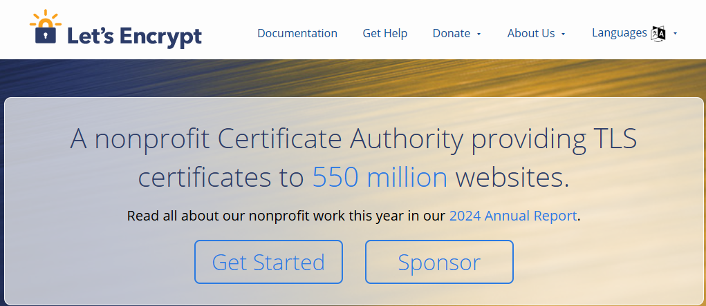
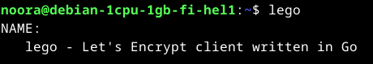
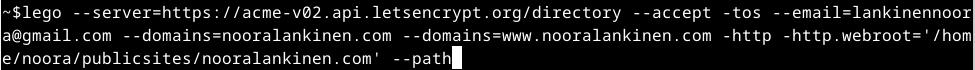
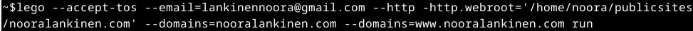
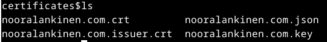
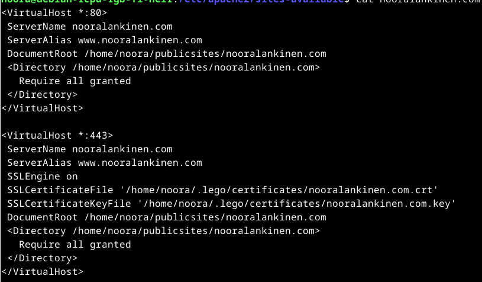
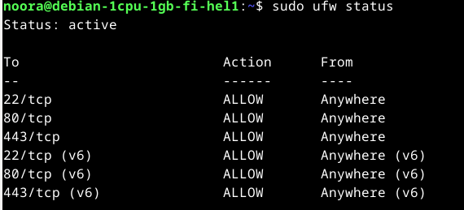
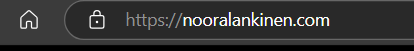

# h6 Salataanpa

# x) Lue ja tiivistä

## Let's Encrypt 2024: How It Works

- Let's Encryptin ja ACME -protokollan tavoitteina tuottaa selaimille luotettava sivu ilman ihmisen väliintuloa.
- Prosessi koostuu kahdesta vaiheesta: verkkotunnuksen vahvistamisesta, sekä varmenteen myöntämisestä ja perumisesta.
- Verkkotunnuksen vahvistamiseksi avainparin avulla, agentin tulee ensin suorittaa hyväksytysti Let's Encrypt -varmentajan antama tehtävä.
- Avainparin avulla myös allekirjoitetaan agentin pyyntö perua varmenne.
  
## Lange 2024: Lego: Obtain a Certificate: Using an existing, running web server
- Lego -työkalun ja sisäänrakennetun verkkopalvelimen avulla voidaan luoda uusi varmenne. 
- Varmenne voidaan hankkia myös verkkotunnuksesi DNS-palveluntarjoajan kautta.
- Varmenteen saamiseksi voidaan käyttää jo olemassa olevaa CSR:ää.
- Mikäli sinulla on jo verkkopalvelin käynnissä portissa 80, sen avulla voidaan myös saada varmenne.

## The Apache Software Foundation 2025: Apache HTTP Server Version 2.4 [Official] Documentation: SSL/TLS Strong Encryption: How-To: Basic Configuration Example 
- SSL -konfiguraatiotiedostossa oltava ainakin seuraavat kohdat:
    LoadModule ssl_module modules/mod_ssl.so
      Listen 443
      <VirtualHost *:443>
        ServerName www.example.com
        SSLEngine on
        SSLCertificateFile "/path/to/www.example.com.cert"
        SSLCertificateKeyFile "/path/to/www.example.com.key"
    </VirtualHost>

    # a) Let's
  
  Tehtävä aloitettu 28.2.2025 kotona klo 16.10.
  
  Fyysinen kone: Suoritin 11th Gen Intel(R) Core(TM) i5-11300H @ 3.10GHz 3.11 GHz Asennettu RAM 8,00 Gt (7,70 Gt käytettävissä)       
  Käyttöjärjestelmä Windows 11 Home, 23H2 Näytönohjain: Intel Iris Xe Graphics

  Oracle Virtualbox Version 7.1.4 r165100 (Qt6.5.3), Debian Live 12.9.0, amd64-xfce, 1 CPU, Base memory: 3005MB. 
  
  Aloitin menemällä Let's Encryptin sivuille (https://letsencrypt.org/), ja klikkaamalla heti etusivun bannerista 'Get Started'.
  
  
  
  Siitä aukesi 'Lets Get Started' -sivu, jossa kerrottiin että useimmissa tapauksissa hosting provider hakee ja hoitaa Let's Encryptin sertifikaatit. Mutta koska hallinnoimme serveriä itse, ei hostausta ole, joten sertifikaatit pitää tällöin hakea itse. Sivusto       
  suositteli
  työkaluksi Certbot ACME Clientiä (https://certbot.eff.org/), mutta tunnilla käytiin läpi Lego, ja se löytyi myös heidän listaamistaan muista hyväksytyistä ACME Clienteistä (https://letsencrypt.org/docs/client-options/).
  Sen jälkeen avasin virtuaalikoneen, ja terminaalin. Päivitysten asentamisen jälkeen asensin Lego:n komennolla

    $sudo apt-get install lego

Asennuksen jälkeen testasin toimivuuden

Menin tämän jälkeen luomaan kansion Lego:lle kotihakemistooni:

Koska meillä on jo olemassa oleva verkkopalvelin portissa 80 käytämme sitä, ja annamme Legolle tiedon, minne haluamme sen kirjoittavan varmenteen saamiseen tarvittavat tiedostot. Tämän vuoksi kävin aiemmin luomassa kansion, jonne tiedostot kirjoitetaan. Komennon runko näyttää jotakuinkin tältä:

    lego --accept-tos --email you@example.com --http --http.webroot /path/to/webroot --domains example.com run

Katsoin tunnilta ottamiani kuvakaappauksia, ja niissä komento näytti hieman erilaiselta. Se oli seuraava (omilla tiedoillani):

Tällä komennolla ei kuitenkaan saanut muuta kuin Legon help -tiedot näkyville. Eli se ei toiminut. Myöskään mitään uusia tiedostoja tai kansioita ei ollut tullut mihinkään. Kokeilin seuraavaksi tuota Legon versiota komennosta omilla tiedoilla: 

Ja nyt tiedostojen luonti näytti onnnistuvan. Kävin vielä tarkistamassa järjestelmän ilmoittamassa tallennuskansiossa /home/noora/.lego , ja sieltä sertifikaatit löytyivätkin.

Eli seuraavaksi tekemään alla näkyvät lisäykset konfiguraatiotiedostoon, /etc/apache2/sites-available/nooralankinen.com.conf. 

Tein reiän palomuuriin portille 443 komennolla 'sudo ufw allow 443/tcp' sekä tarkistin että toiminto onnistui komennolla 'sudo ufw status':

Ja lopuksi menin vielä tarkistamaan selaimelta, että sertifikaatti otettiin käyttöön onnistuneesti: 

  ## Lähteet

  Let's Encrypt: https://letsencrypt.org/

  Let's Encrypt 2024: How It Works, https://letsencrypt.org/how-it-works/

  Lange 2024: Lego: Obtain a Certificate: Using an existing, running web server, https://go-acme.github.io/lego/usage/cli/obtain-a-certificate/index.html#using-an-existing-running-web-server

  The Apache Software Foundation 2025: Apache HTTP Server Version 2.4 [Official] Documentation: SSL/TLS Strong Encryption: How-To: Basic Configuration Example, https://httpd.apache.org/docs/2.4/ssl/ssl_howto.html#configexample
