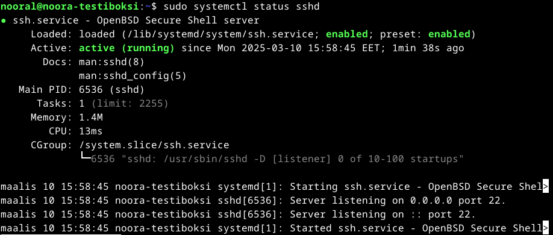
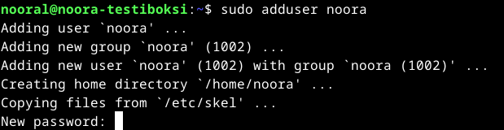

# a) Kirjoita ja aja "Hei maailma" kolmella kielellä

Fyysinen kone: Suoritin 11th Gen Intel(R) Core(TM) i5-11300H @ 3.10GHz 3.11 GHz Asennettu RAM 8,00 Gt (7,70 Gt käytettävissä)
Käyttöjärjestelmä Windows 11 Home, 23H2 Näytönohjain: Intel Iris Xe Graphics

Oracle Virtualbox Version 7.1.4 r165100 (Qt6.5.3), Debian Live 12.9.0, amd64-xfce, 1 CPU, Base memory: 3005MB.

Tehtävä aloitettu 6.3.2025 kotona klo 12.12.

Ensin avasin virtuaalikoneen, ja päivitin ohjelmat komennolla $sudo apt-get update. 
Kyetäkseni ajamaan eri ohjelmointikieliä, minun piti ensin asentaa ne Debianiin. Päätin testata alkuun tehtävän vinkkiosiossa annetun komennon, $ sudo apt-get install python3 gcc g++ openjdk-17-jdk golang-go ruby lua5.4.
Ja se näytti toimivan, koska asennus lähti pyörimään. 

## Python

Asennuksen jälkeen kävin silmäilemässä Pythonin manuaalin läpi, koska se oli näistä ohjelmointikielistä minulle entuudestaan tuttu. Manuaalin saa terminaalissa näkyviin komennolla $ man python3.
Tämän jälkeen menin kirjoittamaan tiedostoa, joka sisältää näytettävän teksin "Hello world". Komento $ nano helloworld.py. 
Tiedoston sisältö:

Ja tämän jälkeen ajoin kyseisen tiedoston: 

Homma näytti toimivan kuten pitääkin. 

Seuraavaksi lähdin testaamaan samaa Bashillä. 

## Bash 

Aloitin taas tutustumalla ensiksi Bashin manuaaliin. 

Äskeisen osion kaavaa toistaen, kirjoitin tiedoston helloworld.sh Nano Editorilla. 

Tiedoston tallennuksen jälkeen ajoin tiedoston: 

Tämäkin toimi odotetusti, joten siirryin viimeisen kielen kimppuun. 

## C

C -kielestä minulla ei ole mitään aiempaa kokemusta, ja sen syntaksi näytti näinkin simppelille toiminnolle yllättävän monimutkaiselta. Kirjoitin kuitenkin Teron esimerkkiä (https://terokarvinen.com/2018/hello-python3-bash-c-c-go-lua-ruby-java-programming-languages-on-ubuntu-18-04/)
noudattaen tiedoston helloworld.c, jonka sisältö näytti seuraavalta: 

Tämän jälkeen jännityksellä ajoin ensimmäisen ajokomennon, myös Teron ohjeen perusteella: 

No, se ei toiminut. Yritin avata C:n manuaalia komennolla $ man c, mutta sekään ei toiminut. Tutkiskelin hetken komennon rakennetta, ja päätin jättää siitä viimeisen 'helloworldc' -osion pois, ja katsoa mitä järjestelmä herjaa. Se kertoikin, että komennosta puuttuu nyt tiedoston nimi. 
Ajattelin, että koska tiedoston nimi oli pelkkä 'helloworld', testaan sillä tuota komentoa, eli jätän viimeisen c-kirjaimen pois tiedostonimestä. Ja sillä se näytti toimivan: 

Jostain syystä minulle jäi kuitenkin pieni epävarmuus siitä, lukiko ohjelma varmasti tämän helloworld.c -tiedoston, eikä esimerkiksi jotain muuta aiemmissa kohdissa luotua helloworld -tiedostoa, joten kävin vielä muokkaamassa helloworld.c -tiedoston tekstiä Nano editorilla, ja ajoin sen sitten uudestaan:

Eli kaikki näytti olevan kunnossa. 

# c) Uusi komento 

Tätä harjoiteltiin jo hieman tiistain oppitunnilla. Luin kuitenkin vielä läpi Teron ohjeen Shell Scriptin luomiseen (https://terokarvinen.com/2007/12/04/shell-scripting-4/). 
Sen jälkeen loin Nano editorilla tiedoston testikomento: $ nano testikomento, jonka sisältö oli seuraava:

Kyseisen scriptin oli siis tarkoitus luoda uusi kansio nimeltä 'uusikansio', näyttää että kansio on luotu, vaihtaa kansion nimi 'roskakansio':ksi, näyttää että vaihto onnistui, jonka jälkeen poistaa kyseinen kansio, ja näyttää vielä lopuksi kansion sisältö.
Testasin scriptin komennolla $ bash testikomento :

Ja sehän ei toiminut, koska scriptin sisällä oli yksi komento väärin. Kävin korjaamassa rivin 'rm roskakansio' -> 'rm -r roskakansio'. 
Ja sitten tallennuksen jälkeen uudelleen scriptin testaus: 

Noh, ei se kaunis ole, mutta scripti periaatteessa kuitenkin toimii. Luettavuuden parantamiseksi rajasin kuvakaappauksessa eri ls -komentojen tulosteet omiksi laatikoikseen. Scriptin toimintaa hieman sekoitti jo edellisessä scriptin ajokomennossa luotu kansio 'roskakansio', jonka poisto kuitenkin epäonnistui, ja se näkyyedelleen ensimmäisen ajetun 'ls' -komennon jälkeen kansioiden joukossa. 
Seuraava komento 'mv uusikansio roskakansio' kuitenkin siirtää uusikansio:n tämän roskakansion sisään, ja lopulta poistaa roskakansion. Eli lopputulos on kuitenkin oikein, koska viimeisessä ls -tulosteessa ei näy enää uusikansio:ta tai roskakansio:ta. 
Kyseinen scripti toimii tällä hetkellä ollessamme kansiossa /home/nooral. Todentaakseni tämän siirryin toiseen kansioon, ja yritin ajaa komennon '$ bash testikomento', siinä kuitenkaan odotetusti onnistumatta: 

Menin seuraavaksi tarkastelemaan kansion käyttöoikeuksia. 

Siellä näyttikin jo kaikilla olevan oikeus ajaa kyseinen tiedosto, joten sitä ei tarvinnut erikseen lisätä. Testasin vielä asian ajamalla '$ /home/nooral/testikomento':

Tehtävänannon mukaisesti, myös muille käyttäjille tuli antaa mahdollisuus ajaa kyseinen komento. 
Eli sitä varten, kyseinen scriptikansio tulee kopioida käyttäjän omasta kotihakemistosta kohteeseen /usr/local/bin, josta se on myös muiden käyttäjien saatavilla. 
Suoritetaan kopiointi komennolla '$ sudo cp testikomento /usr/local/bin/'. 
Tämä toiminto mahdollistaa myös komennon käytön ilman kansiopolkua tai bash -komentoa. Siksi testaamme siirron onnistumisen yksinkertaisesti komennolla '$ testikomento':

Ja sehän toimi sekin. 

Päätin tähän osioon klo 14.33.

## d) Ratkaise vanha arvioitava laboratorioharjoitus

Valitsin tehtäväksi edellisen vuoden kurssin lopputehtävän (https://terokarvinen.com/2024/arvioitava-laboratorioharjoitus-2024-linux-palvelimet/). Tehtävävalinta oli siinä mielessä oivallinen, että heti alkuun pääsin kertaamaan virtuaalikoneen luonnin, koska tehtävänannon mukaan työskentely tuli aloittaa tyhjältä Linux -koneelta. Asensin samalla myös arvioitavaa lopputehtävää varten tarvittavan uuden virtuaalikoneen.

Varsinaisen tehtävän suorituksen aloitin 10.3 klo 13.10. 

## a.) 
Tehtävän raporttia varten loin kotihakemistooni kansion 'Report', ja sinne Nano editorilla tiedoston index.md. Kirjoitin sinne a.) -kohdassa vaadittavat tiedot. 
Tehtävän varsinaisen raportin kirjoitan kuitenkin tänne GitHubiin. 

## b.) Tiivistelmä koko työstä

Tein kaikki kohdat tehtävässä, paitsi h.) Djangon lahjat, koska Djangoa meille ei ole opetettu tässä kurssilla, enkä siis myöskään seuraavaa kohtaa Tuotantopropelli, samasta syystä. 
Kaikki myös toimii tässä raportissa kuvatuilla tavoilla.
 

## c.) Ei kolmea sekoseiskaa
C-kohdassa puolestaan suojataan aiemmin luotu kansio niin, että vain minä pystyn katselemaan raporttia. Mennään siis ensiksi katsomaan, mitkä kansion oikeudet ovat tällä hetkellä. Sen näemme komennolla '$ ls -l'

Eli poistetaan kolmannelta ryhmältä, others, read -oikeudet komennolla '$chmod o-r index.md'. Ja tarkistetaan vielä ls -l -komennolla, että oikeudet ovat nyt oikein:

## d.) 'howdy'

D-kohdassa luodaan shell scripti, jota kaikki käyttäjät voivat käyttää. Luodaan ensin scriptin komennot tekstitiedostoon 'howdy'. Komennon oli tarkoitus tulostaa jotain ajankohtaista tietoa koneesta, joten valitsin komennoiksi 'date' , joka tulostaa päivämäärän ja kellonajan, sekä komennon 'whoami' joka tulostaa käyttäjän. Tiedoston sisältö oli siis seuraava: 

testataan komennon toimivuus ensin itsellä samassa kansiossa, ja sen jälkeen eri kansiossa: 

Ja kuten tässä kohtaa kuuluukin, scripti toimii minulla kyseisessä kansiossa jossa se on, mutta ei siirryttäessä toiseen kansioon. 
Katsotaan komennon käyttöoikeudet: 

Ja kaikilla käyttäjillä oli lukuoikeus, mutta ei oikeutta suorittaa, joten lisätään se oikeus kaikille komennolla '$ chmod ugo+x howdy', ja tarkistetaan taas oikeudet: 

Eli nyt komennon suoritus pitäisi onnistua mistä tahansa kansiosta, kirjoittamalla tiedostopolun /home/nooral/howdy. Eli testataan sen toimivuus vielä käytännössä: 

Toimii kuten pitääkin. Vielä viimeiseksi, tehtävänannon mukaisesti haluamme kuitenkin että komento on paitsi muidenkin käytössä, niin myös käytettävissä ilman bash -alkua tai hakemistopolkua. Siksi kopioimme tiedoston omasta kotihakemistostamme vielä kansioon usr/local/bin. Eli komennolla '$ sudo cp howdy /usr/local/bin/' kopioidaan tiedosto. Katsotaan sen jälkeen, että tiedoston kopiointi todella onnistui kohdekansioon, sekä testataan että komento 'howdy' toimii nyt yksinään: 

Ja vielä viimeiseksi testaus toisella käyttäjällä: 

Testaus tuotti halutun tuloksen. 

## e.) Etusivu uusiksi

Lähdetään asentamaan Apache2 -webbipalvelinta. Komennolla '$ sudo apt-get -y install apache2' saadaan ohjelma asennettua koneelle. Asennuksen jälkeen testataan ohjelma, '$ firefox "http://localhost"' -komennolla: 

Seuraavaksi korvataan aiempi oletussivu, komennolla '$ echo "Uusi oletussivu"|sudo tee /var/www/html/index.html', 

sekä luodaan tiedostopolkuun /etc/apache2/sites-available/ tiedosto 'aikakone.com.conf', jonne laaditaan uusi Name Based Virtual Host -konfiguraatio: 

Otetaan uusi konfiguratio käyttöön: '$ sudo a2ensite aikakone.com' ja 
restartataan Apache: '$ sudo systemctl restart apache2'. 

Luodaan tavallisena käyttäjänä ensin kansiot 'publicsites', ja sen alle vielä 'aikakone.com': '$ mkdir -p /home/nooral/publicsites/aikakone.com/'

Kansioon 'aikakone.com' puolestaan tiedosto index.html, jonka sisällä on nettisivulla näkyvä sisältö: '$ echo kone > /home/nooral/publicsites/aikakone.com/index.html'. 

Testataan komennolla '$ curl -H 'Host: aikakone.com' localhost' 

.. ja komennolla '$ curl localhost'

Käydään muokkaamassa /etc/hosts/ -tiedostoa, lisätään sinne luomamme Name Based Virtual Host aikakone.com, jotta sivua voi jatkossa tarkastella selaimessa:

Ja testataan toimivuus lopuksi selaimessa kirjoittamalla osoiteriville 'aikakone.com': 

..sekä 'localhost':

Ja tästä näemme, että luomamme uusi name based virtual host toimii. Sivun sisältöä voidaan muokata ilman sudo-oikeuksia tiedostossa /home/nooral/publicsites/aikakone.com/index.html. 
Mennään tekemään vielä pieni muutos sivun teksteihin: 

## g.) Salattua hallintaa 

Asennetaan koneelle alkuun ssh-palvelin, komennolla '$ sudo apt-get -y install openssh-server', 
ja asennuksen jälkeen tarkistetaan ssh palvelimen tila: 

Seuraavaksi lisäsin uuden käyttäjän 

Käyttäjän lisäyksen jälkeen lisäsin käyttäjän sudo- ja admin -ryhmiin komennoilla:

    $sudo adduser noora sudo
    $sudo adduser noora adm

Kirjauduin sisään tunnuksella ja laatimallani salasanalla. Laadin ssh-keyn komennolla '$ ssh-keygen'

SSH -keyn liittäminen ssh-kirjautumiseen komennolla '$ ssh-copy-id -i /home/noora/.ssh/id_rsa.pub noora@localhost' 
Testasin kirjautumisen ssh-serveriin, ja salasanaa ei nyt kysytty. Eli liittäminen oli onnistunut. 
Uudelleenkäynnistetään ssh serveri asetusten muokkaamisen jälkeen: '$ sudo systemctl restart sshd'. 

Estetään root-kirjautuminen ssh-serverille: 

Testataan root-kirjautumisen lukituksen onnistuminen: 

Asensin tulimuurin komennolla '$sudo apt-get -y install ufw'. Reiät muuriin puolestaan komennolla $sudo ufw allow 22/tcp, $sudo ufw allow 80/tcp ja $sudo ufw enable. 
Tarkistin vielä lopuksi asetusten toimivuuden komennolla '$sudo ufw status verbose.

 
Lopuksi vielä softien päivitys komennoilla $ sudo apt-get update ja $ sudo apt-get upgrade.

## Lähteet

Noora Lankinen, h4 Maailma kuulee: https://github.com/nooralankinen/linux-palvelimet/blob/h4-Maailma-Kuulee/h4%20Maailma%20Kuulee.md

Tero Karvinen, Arvioitava laboratorioharjoitus 2024: https://terokarvinen.com/2024/arvioitava-laboratorioharjoitus-2024-linux-palvelimet/

Tero Karvinen, Linux Palvelimet 2025 alkukevät: https://terokarvinen.com/linux-palvelimet/

Tero Karvinen, Name Based Virtual Hosts on Apache: https://terokarvinen.com/2018/04/10/name-based-virtual-hosts-on-apache-multiple-websites-to-single-ip-address/

Tero Karvinen, Install Debian on VirtualBox: https://terokarvinen.com/2021/install-debian-on-virtualbox/
